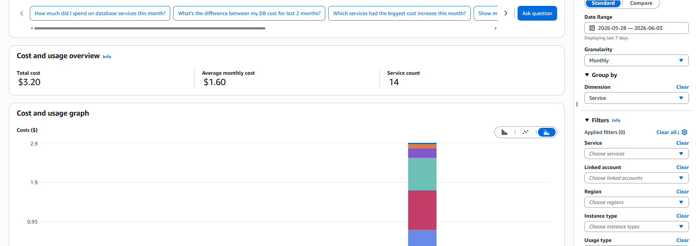
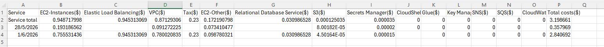

One week into hands-on AWS and I've already blown past my $1 
budget alert, all the way to $3.20.

I had been spinning up and tearing down EC2 instances across a 
few regions, following along with SAA-C03 study material. I was 
reasonably sure I had cleaned everything up. Then I got an email 
from AWS flagging that I had exceeded my budget threshold.

## I Only Checked One Region

My first instinct was to open the console and check ap-southeast-1, 
my primary region. No running instances — so what is eating into 
my bill?

Then I opened AWS Cost Explorer and filtered by region. That's 
when I saw it: charges coming out of us-east-1. I had been jumping 
between regions accidentally while following different labs and 
tutorials, and I only cleaned up the region I remembered working 
in. The other one was still running.

Lesson one for me: always filter Cost Explorer by region first 
when hunting down unexpected charges. Never assume your primary 
region is the only one with live resources.

## The VPC That Wouldn't Delete

Once I identified the region, I went into the console and started 
terminating instances. But the VPC wouldn't delete. AWS won't let 
you delete a VPC until every dependent resource inside it is gone 
— EC2 instances, Elastic IPs, NAT Gateways, ENIs.

I terminated the EC2 instance. Then another one popped out — as 
if it was automatically scaled. Maybe it is!

Turns out I had an Auto Scaling Group running with a desired 
capacity of 1. An ASG doesn't just launch instances, it *maintains* 
them. If the desired count is 1 and I terminate the instance 
manually, the ASG sees that as a failure state and spins a new one 
up to replace it. It's doing exactly what it's designed to do. I 
just didn't realise I had left it running.

The fix was to go into the ASG and delete it directly. When you 
delete an ASG, it terminates all the instances it manages. After 
that, the VPC dependencies cleared up and I could finally delete 
the VPC itself.

## The AMI and Snapshot I Almost Forgot

While cleaning up I also ran into a snapshot attached to an AMI. 
I couldn't delete the snapshot because it was still registered to 
an AMI — I had to deregister the AMI first, then delete the 
snapshot.

Snapshots and volumes are cheap — around $0.05 per GB per month — 
so it's easy to leave them behind and not notice. But I'm setting 
a hard rule for myself: always tear down unused resources. Cheap 
doesn't mean free.

## Cost Explorer — The First Tool I Should Have Opened

When I filtered by service in Cost Explorer, the three services that were most cost heavy were: EC2, ELB, and VPC-related charges. From there I 
clicked into each service in the console to find what was actually 
running.

Cost Explorer is now the first place I go when I need to examine costs. I can slice by region, by service, by time range. It turns 
a confusing bill into something I can actually understand. This skill of being hyper aware of cloud costs is something 
I want to build early. It's the foundation of FinOps and I'd 
rather make it a habit now than scramble later.

## The Actual Bill

[Screenshot of billing dashboard — Week 1]  

[CSV breakdown by service]

Small numbers thankfully, but this taught me exactly what it 
looks like when cleanup is incomplete and I'm not watching every 
region.

---

*Running on AWS SAA-C03 study path. Every resource at 
ap-southeast-1 standard pay-as-you-go rates — no free tier, 
no credits.*